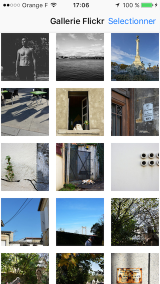
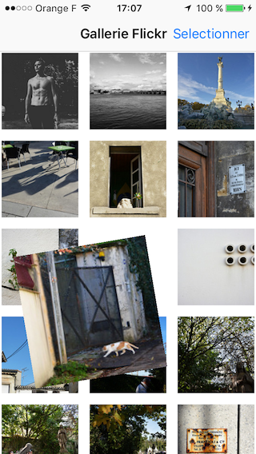
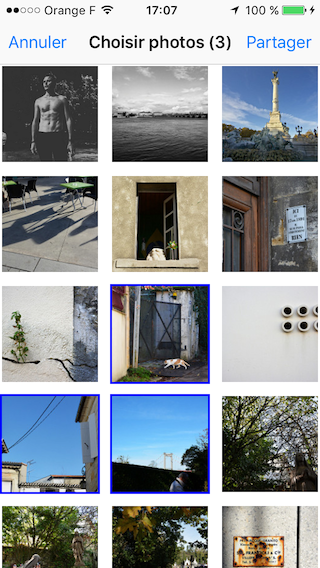
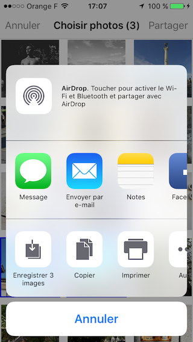

# FlickrGallery

This sample application intends to demonstrate how to interact with the **Flickr** API to display a gallery of photos as well as using several basic iOS components.

The UI is mostly inspired from the iOS **Photo** application.

It also lets you see how to manage an iOS project written in **Swift** and how to bridge some **Objective C** files from previous developments.

## Previews







## Features

* Fetch current location and listen to location updates
* Fetch Flickr photos based on **Flickr** API and your current location
* Store these photos using `CoreData` and the filesystem for a complete offline support
* Display the cached photos in a `UICollectionView` with custom layout to handle animations and bigger item sizes for iPad
* Scale/rotation gestures and each `UICollectionViewCell`
* Display modally zoomed photo with also scale/rotation dismiss gestures
* Multiple photo selection and sharing support
* Pull to refresh

## Technical considerations

This project runs on iOS 8+ iPhone and iPad devices and was developed with the latest **Swift** programming language (2.1). It supports all supported orientations and comes with French and English localizations.

To interact with the **Flickr** API, I created a personal **Yahoo** mail as well as a Flickr account. Finally I created a Flickr application to generate API and secret keys.

I have chosen to use the [FlickrKit](https://github.com/devedup/FlickrKit) library to easily configure and interact with the **Flickr** API without having to worry about **OAuth** authentication and service implementation. This dependency, along with the [MBProgressHUD](https://github.com/jdg/MBProgressHUD) loader view, are managed with [CocoaPods](https://cocoapods.org/).

To fully support an offline mode, all photos downloaded from **Flickr** around your current location are saved using `CoreData`. This operation occurs at each launch and on every location updates. The `NSManagedObject` that models the stored photos contains the downloaded `UIImage` and its url. We store the url as a watch dog to avoid downloading several times the same image. Finally `CoreData` has been configured to allow external storage for the downloaded `UIImage`.

## Limitations

The **Flickr** API allows you to fetch photos with several sizes. When the project was first initiated without offline support, two photo sizes were supported to display a zoomed image with better quality.

In order to fully support the offline mode and to limit the download and cache process, only one (small) size of each photo is now supported. This choice leads to poor image quality while zoomed but gives a usable version of the application with only once relatively long synchronization process on first synchronization.

The database is never purged but only appends new photo into it that did not match any stored photo url.

Finally, this project requires you to accept that the application has access to your current location or photo will never be fetched.

## License

```
Copyright 2015 Stephen Vinouze.

Licensed under the Apache License, Version 2.0 (the "License");
you may not use this file except in compliance with the License.
You may obtain a copy of the License at

   http://www.apache.org/licenses/LICENSE-2.0

Unless required by applicable law or agreed to in writing, software
distributed under the License is distributed on an "AS IS" BASIS,
WITHOUT WARRANTIES OR CONDITIONS OF ANY KIND, either express or implied.
See the License for the specific language governing permissions and
limitations under the License.
```
